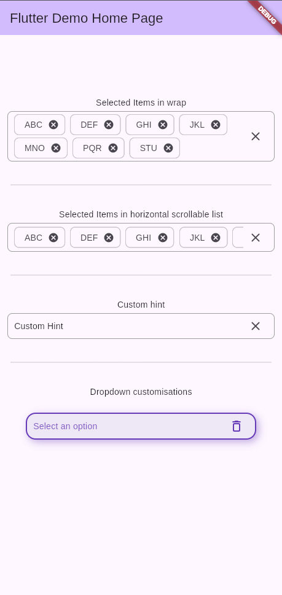

A dropdown that works with all iterables instead of just lists. 
It has multiselect features for selecting multiple items as well.

## Screenshots



| Single Select                                   | Single Select with Search                                          | Multi Select                                  | Multi Select with Search                                         |
|-------------------------------------------------|--------------------------------------------------------------------|-----------------------------------------------|------------------------------------------------------------------|
|  |  |  |  |


## Features

Use this package in your Flutter app to:
 * select multiple items in dropdowns
 * use iterables in a dropdown
 * Have a more beautiful dropdown

## Platform Support

| Platform | Supported |
|----------|------------|
| Android  | ✅ |
| iOS      | ✅ |
| Web      | ✅ |
| Windows  | ✅ |
| MacOS    | ✅ |
| Linux    | ✅ |

## Getting started

Add the package to your Flutter app

```bash
flutter pub add iterable_dropdown
```

Import the package where you want to use it

```dart
import 'package:iterable_dropdown/iterable_dropdown.dart';
```

## Usage

Directly use the component
```dart
@override
Widget build(BuildContext context) {
  return IterableDropdown<String>.builder(
    controller: _dropdownController,
    items: items,
    itemBuilder: (_, _, item, selected, toggleSelection) {
      return ListTile(
        key: ValueKey(item.key),
        title: Text(item.label),
        onTap: toggleSelection,
        trailing: selected
            ? Icon(Icons.check_circle_outline_rounded)
            : Icon(Icons.circle_outlined),
        selected: selected,
        selectedColor: Colors.black,
        selectedTileColor: Colors.deepPurple.shade100,
      );
    },
    selectionMode: SelectionMode.multi,
  );
}
```

## Upcoming Features

### Grouping options
Options can be grouped by a certain field or a combination of fields. The same label can appear twice if they are in separate groups.
This will present hierarchy to the options.

### Network Builder
Options will be fetched using a future, most probably through an API. The `Future` will be called only once.
The dropdown will be in a state of loading until the options are fetched.

## Additional information

You can contribute to this package via the [Github Repo](https://github.com/simranss/flutter_iterable_dropdown). Check out the [Contribution Page](CONTRIBUTING.md) for reference.